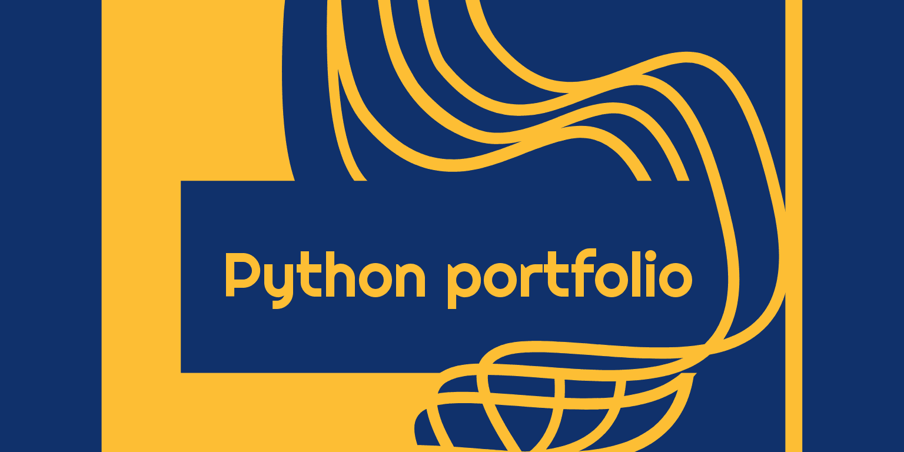
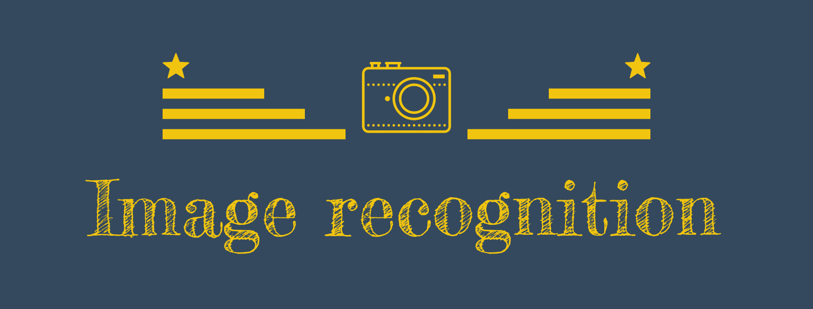
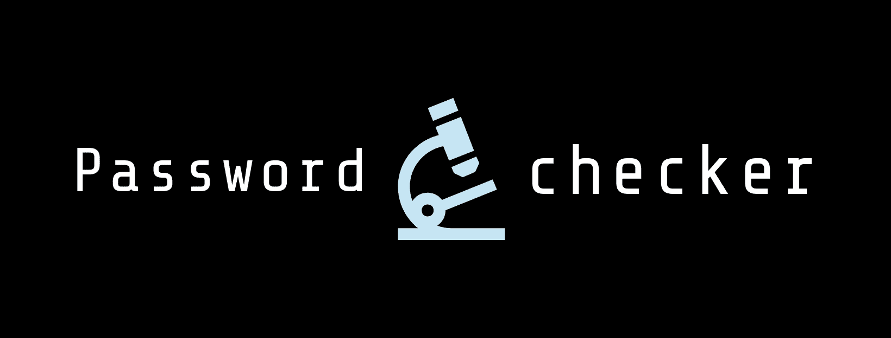
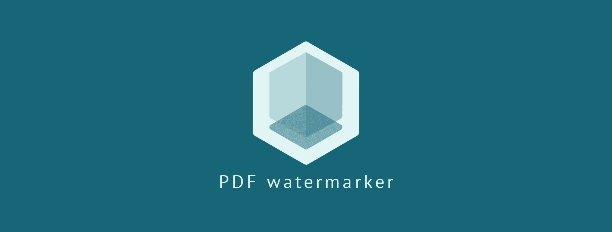

# python-projects

<strong>My Journey in developing the most productive python projects</strong>

New to Python? 
- Check out the [Python Dev Scripts](13) to learn basics to advanced concepts
- Problem Solving never gets old, because it improves the programming skills in general. So, solving few of this [Python programming challenges](14) will exercise your mind.

---

| Scripting | Data Scraping | Automation | Machine Learning & Data Science | Web Development |
| - | - | - | - | - |
| [Password Checker](#) | [IMDb Web Scrapper](#) | [Facebook Automation](#) | [ML Classifier](#) | [Python Portfolio](#Python-Portfolio-Website) |
| [Image Processing](#) | [HackerNews Scrapper](#) |  | [Image Recognition](#) |  |
| [PDF Merger](#) |  |  |  |  |
| [PDF Watermark Adder](#) |  |  |  |  |
| [Email Sender](#) |  |  |  |  |
|  |  |  |  |  |

---

## Python Portfolio Website

<strong>A portfolio built with the help of python on back-end</strong>

[Live Website](12) 
[GitHub Repo](11)

## Machine Learning projects:

### ML-classifier
<strong>A Machnine Learning model which performs classification</strong>

[GitHub Repo](9)

### Image-recognition
<strong>An image recognition script which uses a ML model to recognize a given image</strong>

[GitHub Repo](10)

## Automation projects:

### Facebook-automation
<strong>An automation script for automating sign up page</strong>

[GitHub Repo](8)

## Web scrapping projects:

### IMDb Web Scrapper

IMDb web scrapper is a project which scrapes top IMDb movies and directors

[GitHub Repo](6)

### Hackernews Scrapper
<strong>A python project on Web scrapping with Beautiful Soup</strong>

[GitHub Repo](7)

## Scripting Projects:

### Password checker project: 

<strong>The most secure password checker project</strong>

[GitHub Repo][1]

### Image processing 

<strong>Python script to process images, apply filters, crop and resize images</strong>

[GitHub Repo][2]

### PDF merger 

<strong>The productive python script to add watermarks to numerous PDF files.</strong>

[GitHub Repo][3]

### PDF watermark adder project: 

<strong>The productive python script to merge numerous PDF files.</strong>

[GitHub Repo][4]

### Email sender project 

<strong>The productive python script to send automated emails.</strong>

[GitHub Repo][5]

[1]: https://github.com/AswinBarath/Password-checker
[2]: https://github.com/AswinBarath/image-processing
[3]: https://github.com/AswinBarath/PDF-merger
[4]: https://github.com/AswinBarath/PDF-watermark-adder
[5]: https://github.com/AswinBarath/Email-sender
[6]: https://github.com/AswinBarath/IMDb-web-scrapper
[7]: https://github.com/AswinBarath/Web-scrapper
[8]: https://github.com/AswinBarath/Facebook-automation
[9]: https://github.com/AswinBarath/ML-classifier
[10]: https://github.com/AswinBarath/Image-recognition 
[11]: https://github.com/AswinBarath/python-portfolio
[12]: http://aswinbarath.pythonanywhere.com/
[13]: https://github.com/AswinBarath/python-dev-scripts
[14]: https://github.com/AswinBarath/Python-challenges
