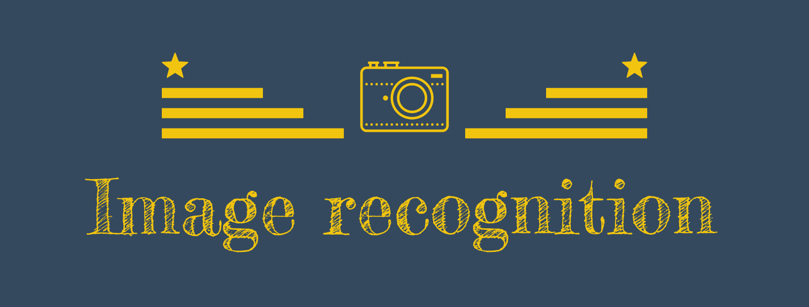

# python-projects

<strong>The most productive python projects</strong>

---

## Python Portfolio Website:

<strong>A portfolio built with the help of python on back-end</strong>

[Live Website](http://aswinbarath.pythonanywhere.com/) 
[GitHub Repo](https://github.com/AswinBarath/python-portfolio)

## Machine Learning projects:

### ML-classifier
<strong>A Machnine Learning model which performs classification</strong>

[GitHub Repo](https://github.com/AswinBarath/ML-classifier)

### Image-recognition
<strong>An image recognition script which uses a ML model to recognize a given image</strong>

[GitHub Repo](https://github.com/AswinBarath/Image-recognition)

## Automation projects:

### Facebook-automation
<strong>An automation script for automating sign up page</strong>

[GitHub Repo](https://github.com/AswinBarath/Facebook-automation)

## Web scrapping projects:

### Hackernews Scrapper
<strong>A python project on Web scrapping with Beautiful Soup</strong>

[GitHub Repo](https://github.com/AswinBarath/Web-scrapper)

## Scripting Projects:

### Password checker project: 

<strong>The most secure password checker project</strong>

[GitHub Repo][1]

### Image processing 

<strong>Python script to process images, apply filters, crop and resize images</strong>

[GitHub Repo][2]

### PDF merger 

<strong>The productive python script to add watermarks to numerous PDF files.</strong>

[GitHub Repo][3]

### PDF watermark adder project: 

<strong>The productive python script to merge numerous PDF files.</strong>

[GitHub Repo][4]

### Email sender project 

<strong>The productive python script to send automated emails.</strong>

[GitHub Repo][5]

[1]: https://github.com/AswinBarath/Password-checker
[2]: https://github.com/AswinBarath/image-processing
[3]: https://github.com/AswinBarath/PDF-merger
[4]: https://github.com/AswinBarath/PDF-watermark-adder
[5]: https://github.com/AswinBarath/Email-sender