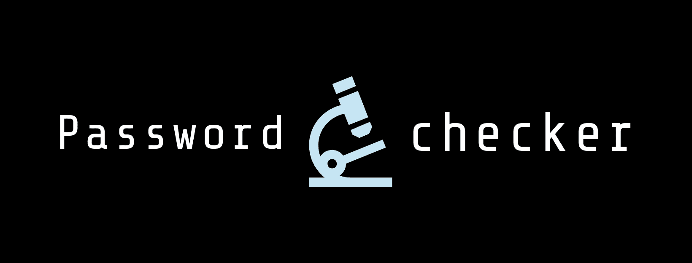
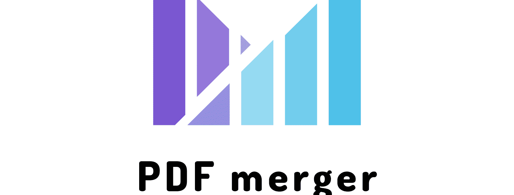

# python-projects

<strong>The most productive python projects</strong>

## Scripting Projects:

### Password checker project: 

<strong>The most secure password checker project</strong>

[GitHub Repo][1]

### Image processing 

<strong>Python script to process images, apply filters, crop and resize images</strong>

[GitHub Repo][2]

### PDF merger 

<strong>The productive python script to add watermarks to numerous PDF files.</strong>

[GitHub Repo][3]

### PDF watermark adder project: 

<strong>The productive python script to merge numerous PDF files.</strong>

[GitHub Repo][4]

### Email sender project 

<strong>The productive python script to send automated emails.</strong>

[GitHub Repo][5]

[1]: https://github.com/AswinBarath/Password-checker
[2]: https://github.com/AswinBarath/image-processing
[3]: https://github.com/AswinBarath/PDF-merger
[4]: https://github.com/AswinBarath/PDF-watermark-adder
[5]: https://github.com/AswinBarath/Email-sender